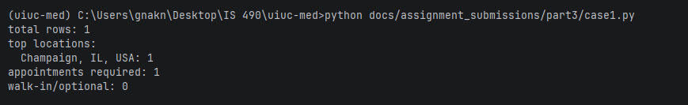
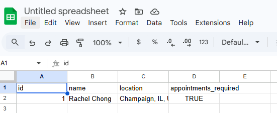
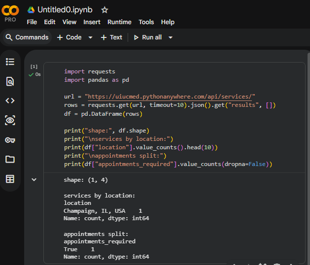

# Part 3.4 - 3 Other Ways People Can Use Our Public API

Public API used for all three:
`https://uiucmed.pythonanywhere.com/api/services/`

whats going on
- which API URL is used
- what data we pulled
- the test code or steps
- what output we got
- screenshot(s) (still need to run and show myself)

---

## Use Case 1: Python script pulls + summarizes the API data

### What this is
This is the basic "developer workflow" use case.  
Someone can hit our endpoint from a script, get live JSON, and do quick summaries without touching our website UI.

### API being accessed
`https://uiucmed.pythonanywhere.com/api/services/`

### Test code
```python
# what chatgpt suggested
import requests
from collections import Counter

url = "https://uiucmed.pythonanywhere.com/api/services/"
payload = requests.get(url, timeout=10).json()
rows = payload.get("results", [])

print("total rows:", len(rows))
print("top locations:")
for loc, n in Counter(r["location"] for r in rows).most_common(5):
    print(f"  {loc}: {n}")

required = sum(1 for r in rows if r["appointments_required"])
optional = len(rows) - required
print("appointments required:", required)
print("walk-in/optional:", optional)
```


### Data used
We used `results` from the API response, specifically:
- `location`
- `appointments_required`

### Output/result



### Screenshot(s)
- `use_case1_python_script_output.png` (show script + terminal output)

---

## Use Case 2: Google Sheets import for non-coding analysis

### What this is
This is the "non-programmer" use case.  
Someone can import the API response into Sheets and immediately sort/filter/make charts for quick reporting.

### API being accessed
`https://uiucmed.pythonanywhere.com/api/services/`

### Test steps
1. Open Google Sheets.
2. `Extensions -> Apps Script`
3. Paste script below, save, and run `importServices()`.
4. Back in Sheets, verify rows were written (headers + data).

```javascript
# chatgpt suggestion
function importServices() {
  const url = "https://uiucmed.pythonanywhere.com/api/services/";
  const res = UrlFetchApp.fetch(url);
  const obj = JSON.parse(res.getContentText());
  const rows = obj.results || [];

  const sheet = SpreadsheetApp.getActiveSpreadsheet().getActiveSheet();
  sheet.clear();
  sheet.appendRow(["id", "name", "location", "appointments_required"]);

  rows.forEach(r => {
    sheet.appendRow([r.id, r.name, r.location, r.appointments_required]);
  });
}
```

### Data used
From `results`, we imported:
- `id`
- `name`
- `location`
- `appointments_required`

### Output/result
A table appears in Sheets with one row per API record, and it can be filtered or charted.

### Screenshot(s)


---

## Use Case 3: Quick notebook-style stats with pandas

### What this is
This is the "light data science" use case.  
A student or analyst can pull the API into pandas and do fast exploration (counts, grouped stats, etc.).

### API being accessed
`https://uiucmed.pythonanywhere.com/api/services/`

### Test code
```python
import requests
import pandas as pd

url = "https://uiucmed.pythonanywhere.com/api/services/"
rows = requests.get(url, timeout=10).json().get("results", [])
df = pd.DataFrame(rows)

print("shape:", df.shape)
print("\nservices by location:")
print(df["location"].value_counts().head(10))
print("\nappointments split:")
print(df["appointments_required"].value_counts(dropna=False))
```

### Data used
Same API `results`, loaded into a dataframe for grouped counting.

### Output/result

---

## Wrap-up

The same public endpoint works in three very different settings:
1. Python automation scripts
2. Spreadsheet workflows (Google Sheets)
3. Notebook/data analysis workflows

That checks the "alternative uses" requirement and shows the API is useful outside our website pages.
